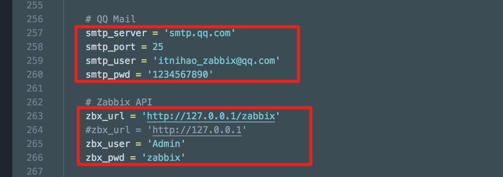
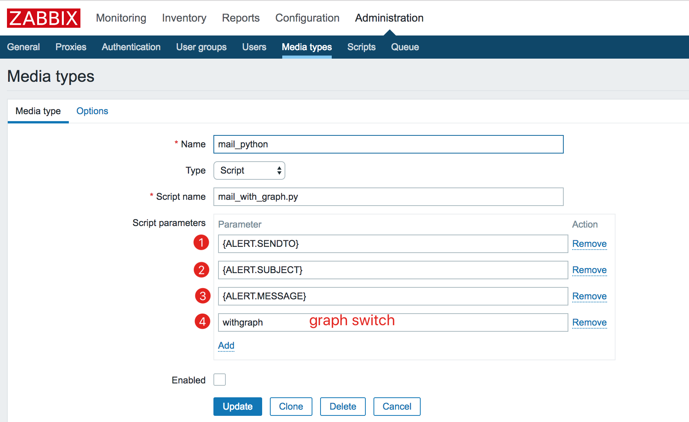
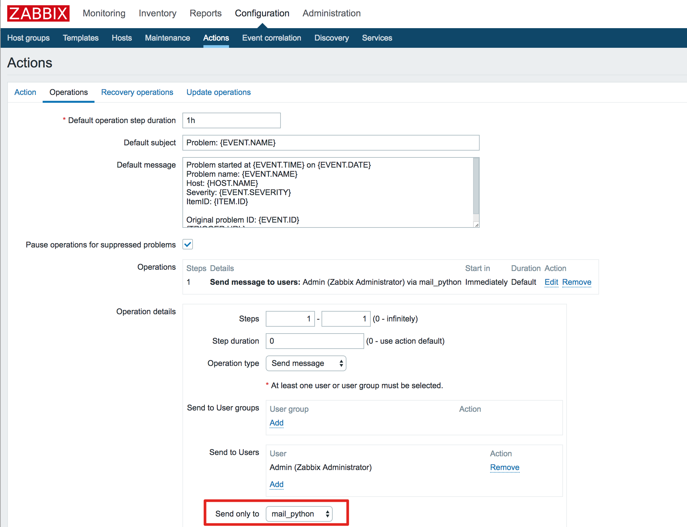
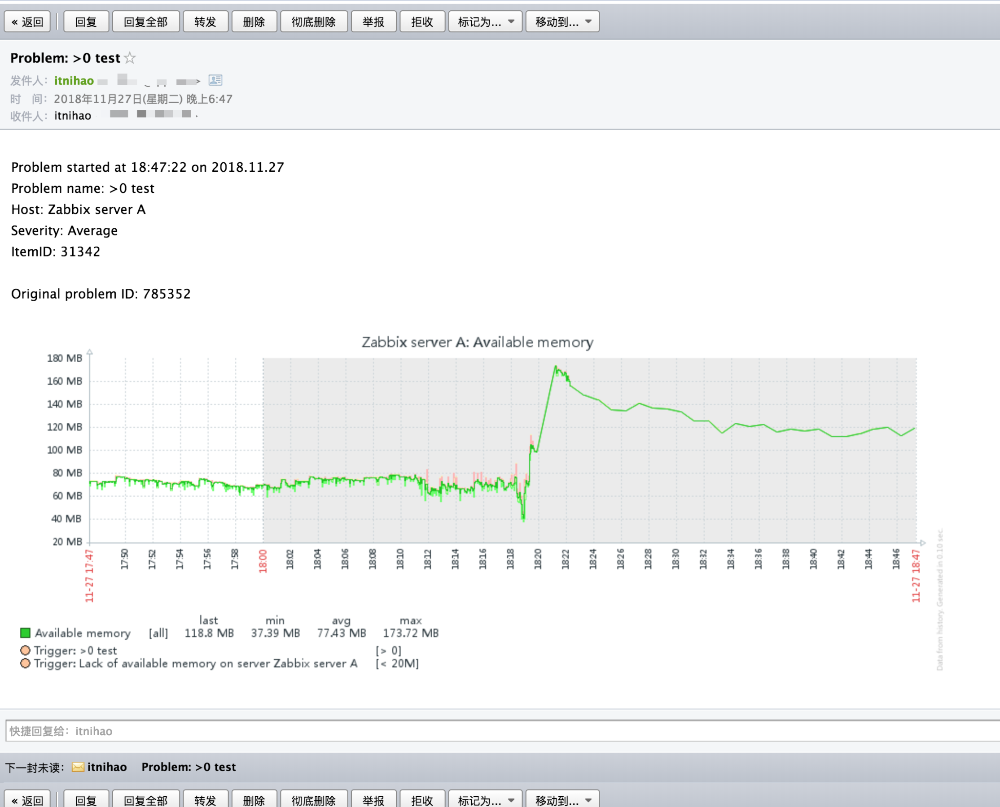

# zabbix_mail_with_graph  
This is a zabbix custom script email with graph   
这是一个Zabbix邮件发送的开源项目，支持邮件发送的时候附带监控指标的图像,如果指标的图像不存在，则不会发送图片 
发送过的日志会保存到/tmp/.zabbix_alert目录，程序自动删除7天以前的发送记录

```
python mail_with_graph.py -h
usage: mail_with_graph.py [-h] receiver subject content [withgraph]

Send mail to user for zabbix alerting

positional arguments:
  receiver    The address of the E-mail that send to user
  subject     The subject of the E-mail
  content     The content of the E-mail
  withgraph   The Zabbix Graph for mail to user

optional arguments:
  -h, --help  show this help message and exit
``` 

# 1. install python module
```
pip install pyzabbix
pip install requests
```

# 2. configration scripts connect information
```
shell# vim mail_with_graph.py
# You email information
smtp_server = 'smtp.qq.com'   
smtp_port = 25
smtp_user = 'itnihao_zabbix@qq.com'
smtp_pwd = '1234567890'

# Zabbix API
zbx_url = 'http://127.0.0.1/zabbix' 
#zbx_url = 'http://127.0.0.1'
zbx_user = 'Admin' #administrator user
zbx_pwd = 'zabbix' #user password
```


# 3. check mail script
```
shell# python mail_with_graph.py you@email.com  '主机linux-2018操作系统被重启(系统启动持续时间和前面一次不同)' '
Message:
Problem started at 18:53:26 on 2018.11.29 
Problem name: 主机linux-2018操作系统被重启(系统启动持续时间和前面一次不同) 
Host: linux-2018 
Severity: Information 
ItemID: 23316   #check itemid

Original problem ID: 836454 '  withgraph
```

# 4. configration zabbix_server.conf
```
shell# vim /etc/zabbix/zabbix_server.conf 
AlertScriptsPath=/etc/zabbix/alertscripts
shell# systemctl restart zabbix-server
```

# 5. cp script to /etc/zabbix/alertscripts
```
shell# cp mail_with_graph.py /etc/zabbix/alertscripts/mail_with_graph.py
shell# chown 700 /etc/zabbix/alertscripts/mail_with_graph.py
shell# chown zabbix:zabbix /etc/zabbix/alertscripts/mail_with_graph.py
```

# 6. configration media type
```
{ALERT.SENDTO}
{ALERT.SUBJECT}
{ALERT.MESSAGE}
withgraph
```
withgraph  is a choice parameter.    
if you want to send mail with zabbix graph, you should configration it  


# 7. configration action
Add ```ItemID: {ITEM.ID}``` to action  
```
Problem started at {EVENT.TIME} on {EVENT.DATE}
Problem name: {EVENT.NAME}
Host: {HOST.NAME}
Severity: {EVENT.SEVERITY}
ItemID: {ITEM.ID}     #Add this

Original problem ID: {EVENT.ID}
{TRIGGER.URL}
```


# 8. trigger a problem

# 9. receive a problem mail

